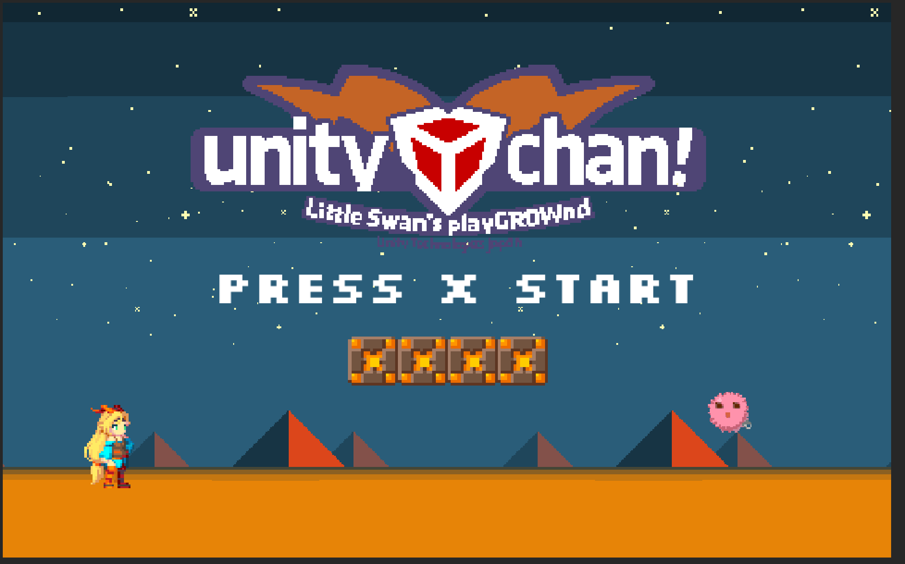
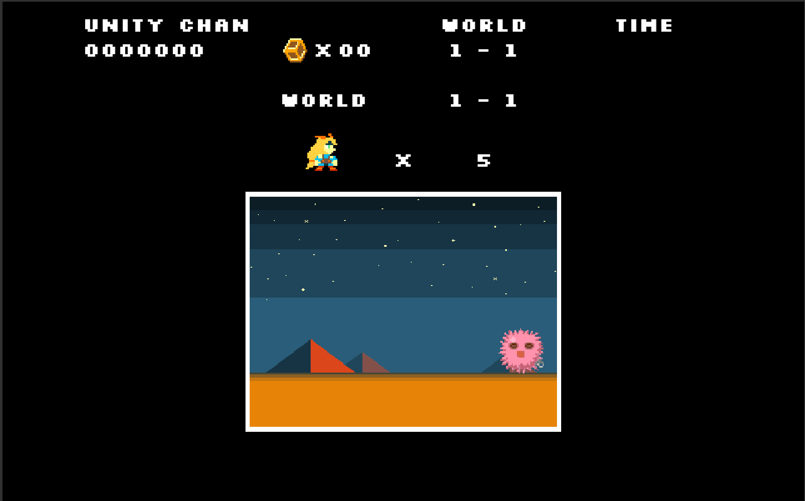
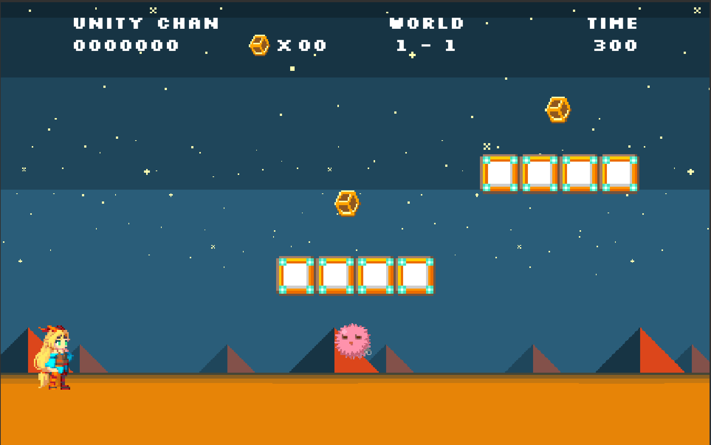
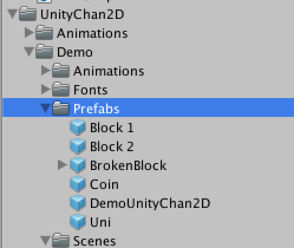
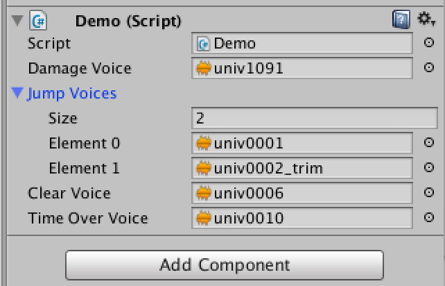
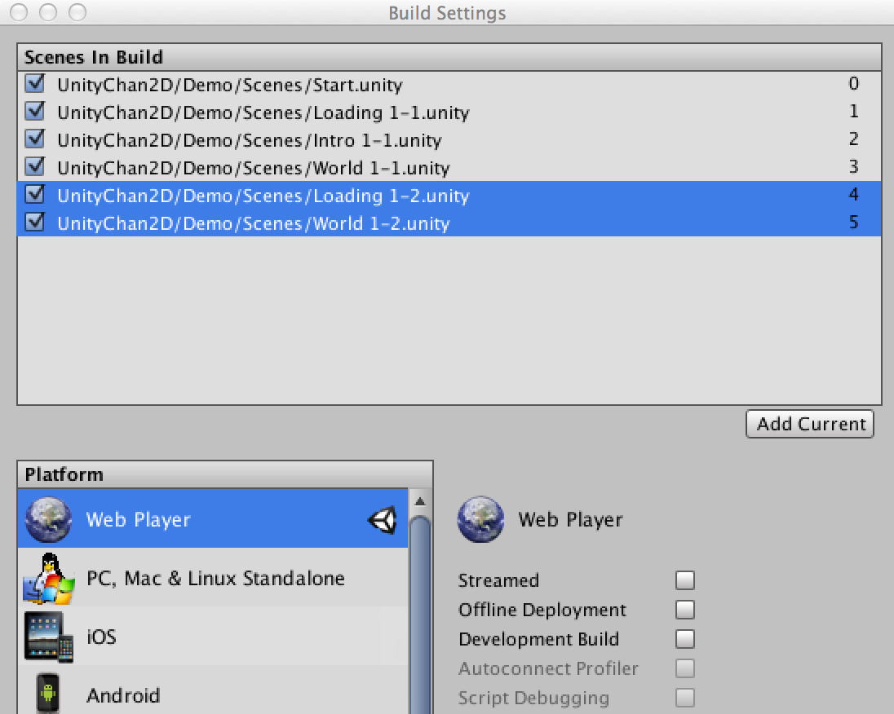
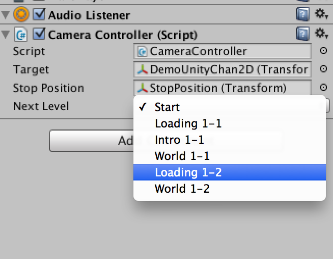
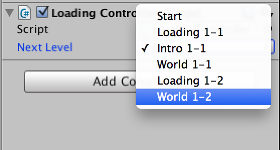

## 推奨設定

このデモシーンはWebPlayer（960 x 600）を想定して作成されています。<br>
異なる画面サイズや他のプラットフォームに変更した場合はカメラやGUIなどの微調整が必要になる場合があります。


# シーンの説明

## Start シーン



ユニティちゃんは自由に動くことが出来ます。<br>
左右ループとなっており、左に移動するとユニティちゃんが右から登場します。

ブロックは壊すことが可能です。

ピンクのウニにユニティちゃんが当たるとダメージを受けます。

Xボタンを押すとゲームを開始します。

<div style="page-break-before: always;"></div>

## Loading シーン



ロード画面です。数秒後、他のシーンへ移動します。

<div style="page-break-before: always;"></div>

## Intro 1-1 シーン

ワールド1-1のためのイントロ演出を行うシーンです。<br>
カメラがステージのゴールからスタートへ移動した後、他のシーンへ移動します。

## World 1-1 シーン



プレイできるシーンです。<br>
右へ進んでいくとゴールへ向かいます。

ピンクのウニに当たるとダメージを受け、コインを取ると画面上のコイン数が増えていきます。

タイムが0になるとStartシーンへ戻ります。

<div style="page-break-before: always;"></div>

# やってみよう！

## ○○を増やすには？



### ピンクのウニを増やすには？

`UnityChan2D/Demo/Prefabs`フォルダに**Uni**プレハブがあります。これをシーン上へドラッグ＆ドロップして増やしていきましょう。

### コインを増やすには？

`UnityChan2D/Demo/Prefabs`フォルダに**Coin**プレハブがあります。これをシーン上へドラッグ＆ドロップして増やしていきましょう。

<div style="page-break-before: always;"></div>

### 壊れるブロックを増やすには？

`UnityChan2D/Demo/Prefabs`フォルダに**Block 1**プレハブがあります。これをシーン上へドラッグ＆ドロップして増やしていきましょう。

### 壊れないブロックを増やすには？

`UnityChan2D/Demo/Prefabs`フォルダに**Block 2**プレハブがあります。これをシーン上へドラッグ＆ドロップして増やしていきましょう。

## ユニティちゃんのボイスを変更するには？

**DemoUnityChan2D**ゲームオブジェクトに**Demo.cs**がアタッチされています。<br>
ボイスはインスペクター上で変更することが可能です。



<div style="page-break-before: always;"></div>

## ワールド1-2を作成するには？

1. Loading 1-1とWorld 1-1 シーンを複製しましょう。そうすると自動的に名前が**Loading 1-2**と**World 1-2**となります。
2. Buid Settings ウィンドウにシーンを追加します。
	
	
3. **World 1-1**シーンを開き、**Main Camera**ゲームオブジェクトにアタッチされている**CameraController.cs**の`Next Level`をStartから**Loading 1-2**へ変更します。

	
4. **Loading 1-2**シーンを開き、**Loading Controller**ゲームオブジェクトにアタッチされている**LoadingController**の`Next Level`をIntro 1-1から**World 1-2**へ変更します。

	
5. 以上でシーンの遷移は完了しました。**Loading 1-2**と**World 1-2**シーンを1-2用に変更していきましょう！
6. 余裕があればIntroシーンも作成してみましょう。

## タイマーとポイントを管理するには？

管理するシステムは作成していません。自分で作成してみましょう！

タイマーは**TimeController**、ポイントは**PointController**でテキスト表示のみ行っています。

## 残機を減らすには？

残機を減らす・管理するシステムは作成していません。自分で作成してみましょう！

```
タイムオーバー時にシーン遷移を行います。TimeControllerにシーン遷移を実装しており、現在はStartシーンへ戻るようになっています。
残機を減らして再度同じワールドへシーン遷移するようにしてみましょう。
```