# ユニティちゃん2Dの使い方

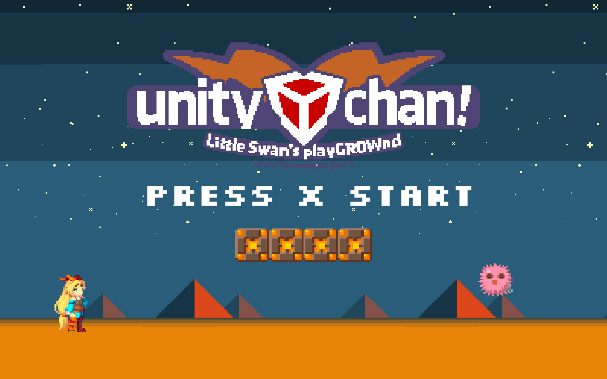


## 目次

* ユニティちゃん2Dの使い方
  * ユニティちゃんを足場に立たせる
  * ユニティちゃんがダメージを受けるゲームオブジェクトを作成する
  * 移動速度・ジャンプ力・のけぞる力を変更する
  * 複数のレイヤーを足場とする
  * スクリプトで呼び出されるコールバック

<br><div style="page-break-before: always;"></div>

## ユニティちゃんを足場に立たせる

UnityChan2D/Prefabs配下にあるUnityChan2Dプレハブ

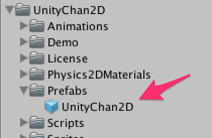

プレハブをシーン上にドラッグ＆ドロップしてください


<div style="page-break-before: always;"></div>

ゲームを再生すると下に落ちます

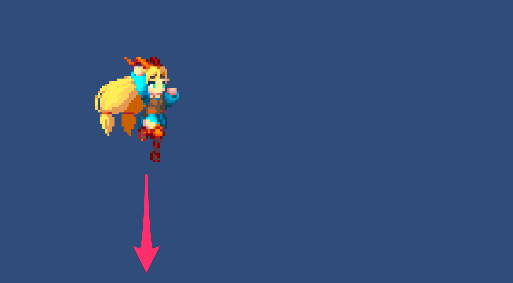


下に落ちないように**BoxCollider2D**で足場を作りましょう。

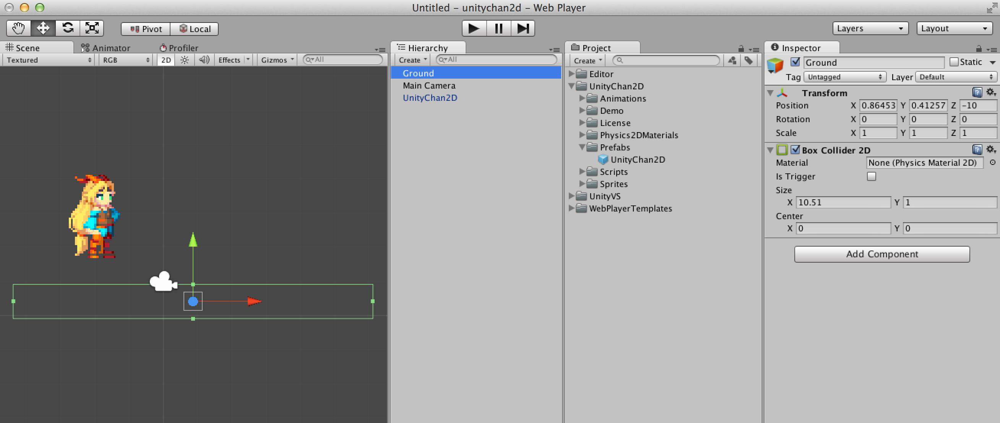

<div style="page-break-before: always;"></div>

ですが足場に着地しても落下中のアニメーションのままです。

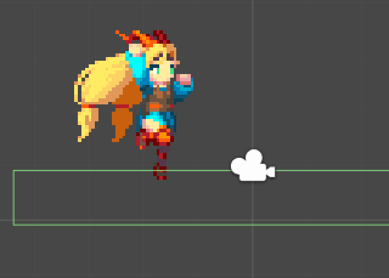

<div style="page-break-before: always;"></div>

<span style='color:red'><b>[重要]</b></span> 足場のレイヤーを**Ground**にしましょう。まず、`Tags and Layers` で**Ground**を登録します。<br>
この時、Groundを登録する場所は「User Layer 8」以外でも構いません。

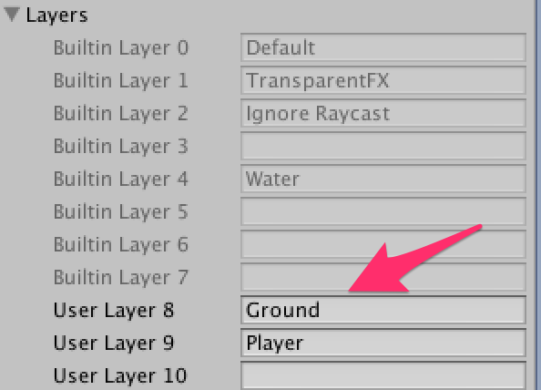

<span style='color:red'><b>[重要]</b></span> レイヤーを登録したら**Ground**を設定します。

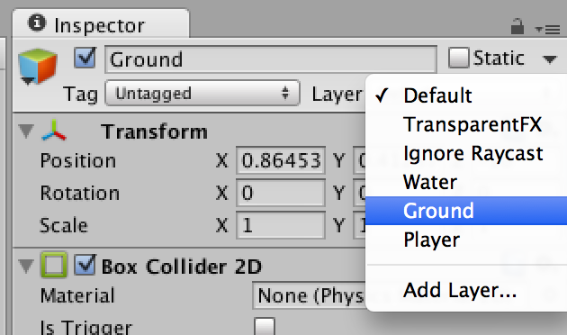

<div style="page-break-before: always;"></div>

<span style='color:red'><b>[重要]</b></span> さらに、UnityChan2Dプレハブまたはゲームオブジェクトにアタッチされている**UnityChan2DController**の`What Is Ground`で**Ground**を選択します。

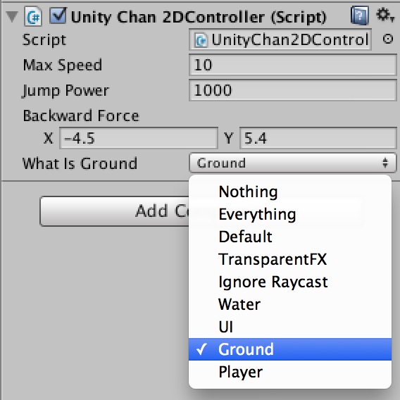

<div style="page-break-before: always;"></div>

無事足場の上に立つことが出来ました。

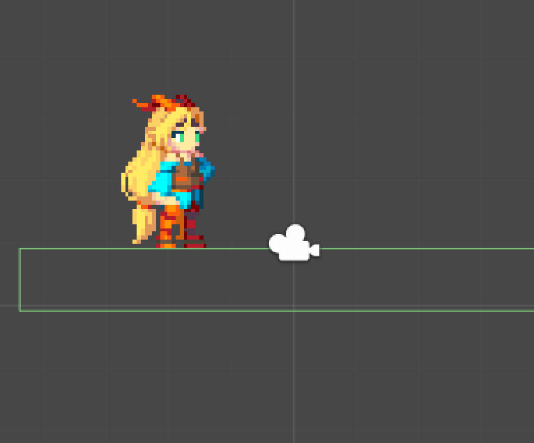

<div style="page-break-before: always;"></div>

## ユニティちゃんがダメージを受けるゲームオブジェクトを作成する

`UnityChan2D/Demo/Sprites`にある**uni_0**をドラッグ＆ドロップします。

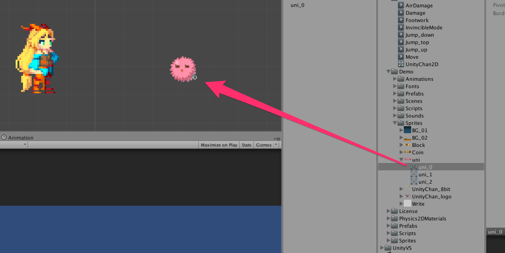

<span style='color:red'><b>[重要]</b></span> **Uni_0**ゲームオブジェクトに**Circle Collider 2D**をアタッチしましょう。そして**Is Trigger**にチェックを入れます。

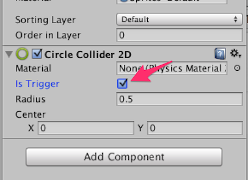

<div style="page-break-before: always;"></div>

<span style='color:red'><b>[重要]</b></span> 次にタグを登録します。**DamageObject**を登録します。これがダメージ判定を行うための印となります。

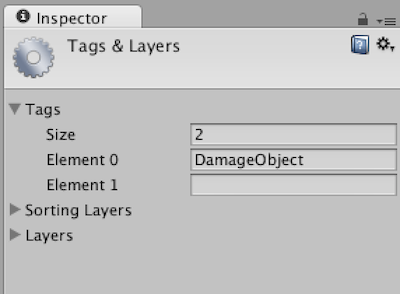

<span style='color:red'><b>[重要]</b></span> **uni_0**ゲームオブジェクトに**DamageObject**タグを設定します。

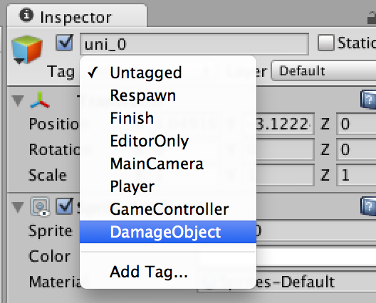

ぶつかるとダメージを受けたようなアニメーション＆のけぞりが再生されます。

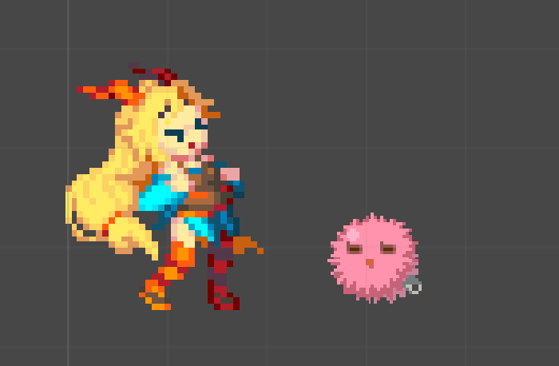

<div style="page-break-before: always;"></div>

## 移動速度・ジャンプ力・のけぞる力を変更する

* Max Speed: ユニティちゃんの移動スピード
* Jump Power: ユニティちゃんのジャンプ力
* Backward Force: ダメージを受けた時に後ろにのけぞる力

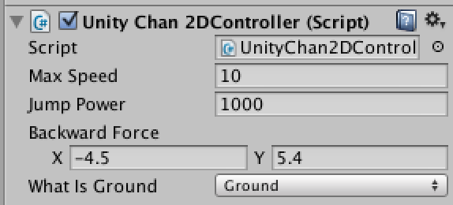

<div style="page-break-before: always;"></div>

## 複数のレイヤーを足場とする

`What Is Ground`で複数のレイヤーを指定すれば、該当するレイヤーが設定されているゲームオブジェクトは全て足場になります。

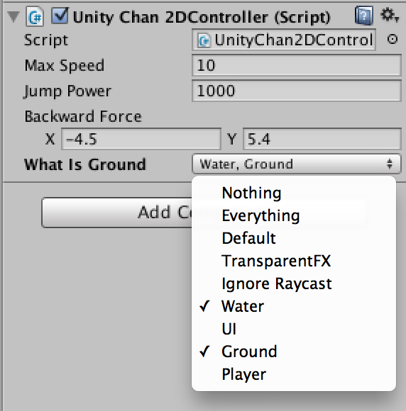

<div style="page-break-before: always;"></div>

## スクリプトで呼び出されるコールバック

<span style='color:red'><b>[重要]</b></span> コールバックを呼び出すためには**UnityChan2DController.cs**がアタッチされているゲームオブジェクトにスクリプトファイルをアタッチしないといけません。

### OnDamage

ユニティちゃんがダメージを受けた時に呼び出されます。

### Jumping

ユニティちゃんがジャンプした直後に呼び出されます。


```
using UnityEngine;

[RequireComponent(typeof(UnityChan2DController))]
public class Demo : MonoBehaviour
{
    void OnDamage()
    {
		
    }

    void Jump()
    {
        
    }
}
```

実際に使用しているコードは`UnityChan2D/Demo/Scripts/Demo.cs`を御覧ください。
